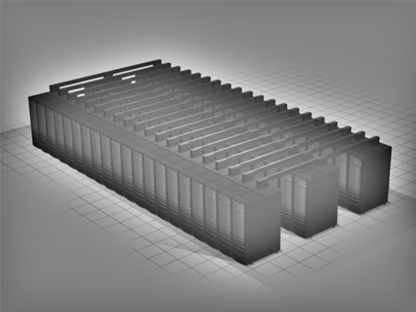

<!-- Main -->

<!-- One -->
<section id="one">
	

		<header class="major">
			<h2>About</h2>
		</header>
		
I am a master student at Sun Yat-Sen University in Computational Mathematics. My study is in the area of Numerical Solution of Partial Difference Equations with main focus on Stable Generalized Finite Element Method. Through the undergraduate and graduate studies of mathematics, I am now more interested in the fields of computational science and engineering, and hope to learn more about how to apply the knowledge I have learned to practical problems. In this page there are some of my research experience and computer skills.

	

</section>

<!-- Two -->
<section id="two" class="spotlights">
	<section>
		
		

			

				<header class="major">
					<h3>Stable Generalized Finite Element Method (SGFEM)</h3>
				</header>
				
Generalized or eXtended finite element methods (GFEM/XFEM) for crack problems have been studied extensively. A GFEM/XFEM is referred to as stable GFEM (SGFEM) if it reaches optimal convergence orders, and its SCN is of same order as that of FEM. In this article we propose the SGFEM for elasticity crack problems; both extrinsic and DOF-gathering schemes are addressed. <b>My main work is numerical experiments
which demonstrate that the proposed SGFEM and DOF-gathering SGFEM are of optimal convergence and have the SCNs of same order as in the FEM</b>. We also propose a SGFEM for 3D crack problems. The numerical experiments for both the planar and fully 3D crack problems are executed to verified efficiency of the proposed SGFEM.

				<ul class="actions">
					<li><a href="https://doi.org/10.1002/nme.6347" class="button">Learn more</a></li>
				</ul>
			

		

	</section>
	<section>
		<a href="landing.html" class="image">
			

				

					

					

					<!-- Break -->
					

					

					<!-- Break -->
					

					

				

			

		</a>
		

			

				<header class="major">
					<h3>The Message Passing Interface (MPI)</h3>
				</header>
				
MPI (Message-Passing Interface) is a message-passing library interface specification. Here are some simple examples I have done. These pictures show the result of the case study. The aim of this case study is to write a complete MPI parallel program that does a very basic form of image processing. The case study is actually to do the reverse operation and construct the initial image given the edges. 
				<ul>
					<li><a href="http://archer.ac.uk/training/course-material/2014/07/MPI_Edi/">Material</a></li>
					<li><a href="https://github.com/CuiCu-618/MPI">GitHub</a></li>
				</ul>
				

				<ul class="actions">
					<li><a href="https://github.com/CuiCu-618" class="button">Learn more</a></li>
				</ul>
			

		

	</section>
	<section>
		<a href="generic.html" class="image">
			
			
<!-- 			

				

					

					

				

			
 -->
		</a>
		

			

				<header class="major">
					<h3>MATLAB</h3>
				</header>
				
MATLAB is a multi-paradigm numerical computing environment and proprietary programming language developed by MathWorks. I have used MATLAB to program some numerical algorithms since the undergraduate level. In addition to the tutor’s program, the learning of finite element method programming also involves learning through the book <b>Programming the Finite Element Method</b>. I have implemented most of the program algorithms in the book with MATLAB. Also I use SPMD module to parallelize the current program for acceleration. 
		
<pre><code>
spmd
    statements
end
</code></pre>
				<ul>
					<li><a href="https://github.com/CuiCu-618/matlab_version">Programming the Finite Element Method Code</a></li>
					<li><a href="https://www.mathworks.com/help/parallel-computing/spmd.html?s_tid=srchtitle">SPMD</a></li>
				</ul>
				<ul class="actions">
					<li><a href="generic.html" class="button">Learn more</a></li>
				</ul>
			

		

	</section>
</section>

<!-- Three -->
<section id="three">
	

		<header class="major">
			<h2>Massa libero</h2>
		</header>
		
Nullam et orci eu lorem consequat tincidunt vivamus et sagittis libero. Mauris aliquet magna magna sed nunc rhoncus pharetra. Pellentesque condimentum sem. In efficitur ligula tate urna. Maecenas laoreet massa vel lacinia pellentesque lorem ipsum dolor. Nullam et orci eu lorem consequat tincidunt. Vivamus et sagittis libero. Mauris aliquet magna magna sed nunc rhoncus amet pharetra et feugiat tempus.

		<ul class="actions">
			<li><a href="generic.html" class="button next">Get Started</a></li>
		</ul>
	

</section>

